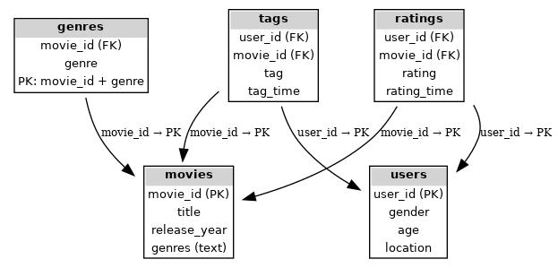
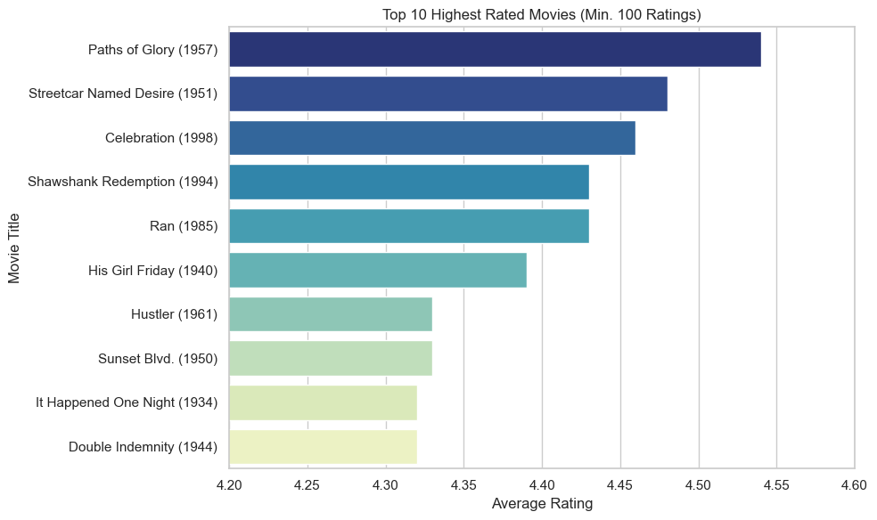

# 🎬 MovieLens SQL Analytics
📊 **PostgreSQL + Python + Data Visualization** project analyzing the MovieLens dataset. Built to demonstrate **SQL modeling, ETL, advanced queries, and insights visualization** — fast, clean, and production-ready.

## 🚀 Highlights
- 🗄 **Database Design** – Fully normalized schema with PK/FK integrity  
- ⚡ **ETL with Python** – Loads raw CSV into PostgreSQL via SQLAlchemy  
- 📈 **Advanced SQL** – Joins, aggregations, HAVING filters, subqueries  
- 🎨 **Visualizations** – Charts and CSV reports for key insights  

## 🗺 ERD


## 📊 Example Output


## 📂 Structure
sql/         → create_tables.sql, analysis_queries.sql  
scripts/     → load_data.py, analysis.py  
data/        → MovieLens CSV dataset  
output/      → CSV results + charts  

## 📊 Sample Insights
- 🎥 **Top Rated Movies** (min 100 ratings)  
- 📌 **Most Popular Movies** by number of ratings  
- 🎭 **Average Ratings by Genre**  
- 👫 **Gender Rating Gaps** (synthetic demo data)  

## 🔧 Quick Start
```bash
python scripts/load_data.py
python scripts/analysis.py
```

## 🛠 Tech Stack
**PostgreSQL**, **Python (pandas, SQLAlchemy, matplotlib)**, **GitHub**
